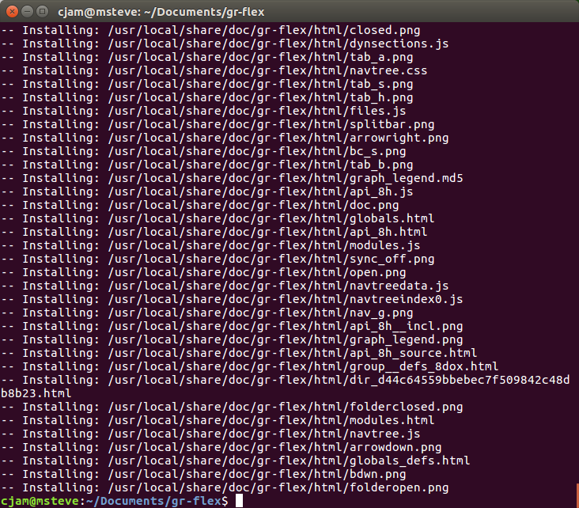
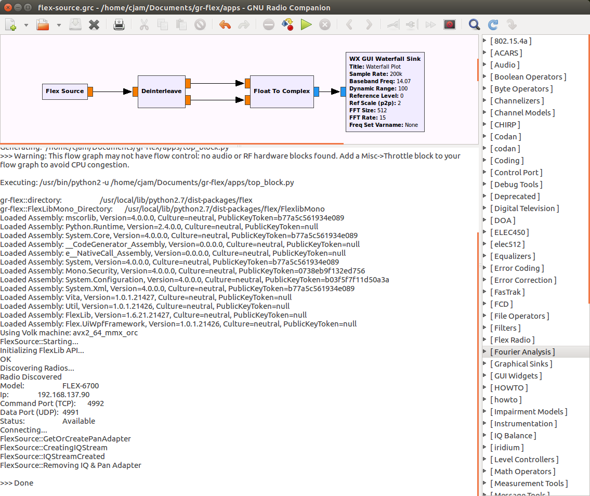

# GNU Radio Flex Blocks (gr-flex)

An out-of-tree GNU Radio block for communicating with the FlexRadio

### Architecture


### References

[GNU Radio OOT Blocks](https://wiki.gnuradio.org/index.php/OutOfTreeModules)

## Getting Started

These instructions will get you a copy of the project up and running on your local machine for development and testing purposes. See deployment for notes on how to deploy the project on a live system.

This project uses a .Net library called FlexlibMono which I have forked and included as a submodule within this project.  You will need to run

`git submodule update --init`

### Prerequisites

You will need the following pre-requisites installed on your machine (in this order):
>Note: The same pre-requisites are needed for all OS's, but the code blocks are specific to Ubuntu/Debian (except the Python snippets)

- [GNU Radio](https://wiki.gnuradio.org/index.php/InstallingGR)
```
sudo apt-get install gnuradio
```

- [Python](https://www.python.org/) (**is required by GNU Radio and so is probably installed on your computer by now**, gr-flex was tested with 2.7)

- [Mono](http://www.mono-project.com/download/) **(only needed for MacOS/Linux systems)**
```
sudo apt-get install mono-devel
```

- [pip](https://pip.pypa.io/en/stable/installing/) **(already installed if Python 2 >=2.7.9 is installed)**

- [PythonNet] **(if the following doesn't work, see the [troubleshooting](#troubleshooting) section)**
```
sudo -H pip install pythonnet
```

- [cmake](cmake.org)
```
sudo apt-get install cmake
```

### Installing the Block

Once all of the pre-requisites are installed, you can run the build script within the root of the project.

```
cd <repo_director>
sudo ./build.sh
```
This script will do the following:

- Build the Flexlib Mono project with MSBuild (Release Configuration)
- Copy the resulting binaries into the gr-flex module
- create a `build/` directory
- runs `CMake`  (configures make files)
- runs `make`   (builds python module)
- runs `sudo make install`  (installs block into GNU Radio directory)

Here's some sample output from the script (installing into the GNU Radio folders):


### Using the Block
Here's how the **Flex Source** block currently looks in GNU Radio:


### Sample Apps
See the sample **GRC** files that have been placed into the `apps/` directory of this repo:

`./apps/flex-source.grc` - sends FlexRadio data to a waterfall plot

## Running the Samples

Running the sample GRC files will show output from the gr-flex block that could potentially help with troubleshooting problems.

The FlexRadio has a discovery mechanism that works on the local area network to allow for applications to discover and configure themselves to interact with the FlexRadio.  

When the Flex Source starts up, it will go through the discovery process and output the results within the terminal.



## Troubleshooting
If you're having problems installing [PythonNet](#pythonnet) the following may help.

- [setuptools](pypi.python.org/pypi/setuptools) **(At least on Ubuntu 16.04, setuptools is likely outdated which causes problems installing pip as well as pythonnet)**. To check which version you have, run:
```python
python
import setuptools
setuptools.__version
```
The current version is listed at https://pypi.python.org/pypi/setuptools.
If you need to upgrade it:
```
wget https://bootstrap.pypa.io/get-pip.py
sudo -H python get-pip.py
sudo -H pip install setuptools --upgrade
```

- [gliblib](https://packages.ubuntu.com/xenial/libglib2.0-dev) **(in ubuntu at least, the following is necessary)**
```
sudo apt-get install libglib2.0-dev
```

- Finally, try installing pythonnet using an egg by running:
```
sudo pip install git+https://github.com/pythonnet/pythonnet --egg
```

## Running the tests

Unfortunately since the block requires the presence of a FlexRadio, it makes mocking the block much harder to do.  To test this module, the sample apps were used with a Flex system to test and confirm functionality.

## Built With

* [CMAKE](https://cmake.org/) - CMake
* [MSBuild](http://www.mono-project.com/docs/tools+libraries/tools/xbuild/) - MSBuild (Mono)
* [PythonNet]
* [GNU Radio]

## Contributing

Pull Requests are welcome.

## Versioning

We use [SemVer](http://semver.org/) for versioning. For the versions available, see the [tags on this repository](https://github.com/your/project/tags).

## Authors

* **Colter Mcquay** - *Initial work*

See also the list of [contributors](https://github.com/your/project/contributors) who participated in this project.

## License

This project is licensed under the MIT License - see the [LICENSE.md](LICENSE.md) file for details

## Acknowledgments

Thanks to the following students who wrote some reports that provided some insight / approaches to solving this problem.

- Robert Cormier
- Marian Böhm
- Donatus Unuigboje

Thanks to [Frank Werner-Krippendorf](https://github.com/krippendorf) for the work on the [FlexlibMono](https://github.com/krippendorf/FlexlibMono) project which I forked and used as a submodule within this repository.

[GNU Radio]: https://wiki.gnuradio.org/index.php/InstallingGR "GNU Radio"
[PythonNet]: https://pythonnet.github.io/ "Python.Net"
[Mono]: http://www.mono-project.com/download/ "Mono"
